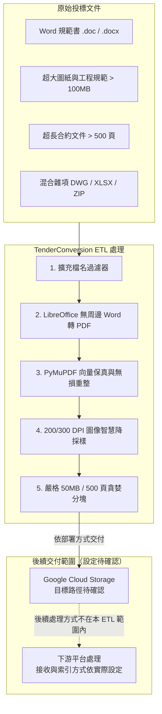

# 服務概覽：投標文件 RAG ETL 管道 (Service Overview: Tender RAG ETL Pipeline)

**適用對象：** 全體人員 / 業務主管 / 投標專案經理 / 系統架構師
**文件狀態：** 現行版本
**最後審核：** 2026-10-05

> 備註：以下技術架構與雲端平台服務邊界，於 2026 年 10 月 05 日審閱本文件時仍然有效。

---

## 簡要說明 (Summary)

本專案是一套為大型投標文件設計的高保真 ETL（Extract-Transform-Load）前處理管道。它會處理 `.doc`、`.docx` 及 `.pdf` 等格式的工程合約、規範與圖紙，並將文件轉換、最佳化及分塊，產出符合 **Google Cloud Agent Enterprise Platform** 輸入規格的 PDF 資料集。這些輸出文件可作為後續建立 RAG 檢索知識庫的資料來源；平台端的索引與 Agent 設定不屬於本管道的工作範圍。

---

## 為什麼需要本 ETL 管道？(Business & Technical Drivers)

大型投標文件在交由雲端平台處理前，常遇到格式、檔案大小及頁數等限制。本管道的設計重點如下：

1. **符合檔案大小與頁數限制：**
   - 單一輸出文件以小於 **50 MB**、不超過 **500 頁**為目標；超出限制時，管道會依設定進行分塊。
   - 實際適用的平台限制可能因服務或設定而異，請以部署環境的規格為準。
2. **保留文字內容與版面資訊：**
   - 若將整份 PDF 轉成點陣圖，原生文字層便無法保留，會影響後續文字擷取。
   - 管道會保留原生文字及頁面幾何資訊，並只對符合條件的高解析度點陣圖進行降採樣。單頁超出限制時，則依救援流程處理。
3. **保留原有資料夾結構：**
   - 輸出資料夾會保留來源文件的相對路徑，方便後續整理及追溯各文件的來源位置。

---

## 服務邊界與系統職責 (Service Scope & Boundaries)

| 處理階段 | 本專案職責範圍 (In Scope) | 外部平台職責範圍 (Out of Scope / GCloud) |
|---|---|---|
| **前置篩選** | 掃描目錄、篩選 `.doc`、`.docx`、`.pdf`，並保留來源子目錄結構 | 檔案伺服器權限管理、原始檔案備份 |
| **格式轉換** | 以無周邊 LibreOffice 將 Word 高保真轉為 PDF | Word 原始檔排版修正、缺字補正 |
| **體積最佳化** | PDF 物件無損去重重整（Flate 壓縮）、DPI 閾值偵測與精確重採樣 | 雲端 Document AI OCR 計費與辨識 |
| **規格處理** | 依 `--max-mb` 與 `--max-pages` 設定檢查輸出檔案，超限時嘗試分塊；單頁無法救援時會保留原始檔案並回報 | Google Cloud Storage 檔案儲存生命週期 |
| **品質驗證** | 文字層 Hash 雜湊比對、頁數/旋轉/框線不變性校驗、輸出檔數對齊斷言 | 向量嵌入生成（Vector Embedding）、RAG Agent 語意問答 |

---

## 核心價值與對營運的影響 (Operational Impact)

- **減少手動整理工作：** 管道可批次處理文件，減少逐份轉檔、壓縮及分塊所需的人工作業。
- **便於後續交付：** 輸出文件保留來源目錄結構，並依設定檢查大小與頁數，方便後續同步至 GCS。
- **保留可搜尋文字：** 對一般處理流程而言，保留原生文字層有助於後續平台擷取文件內容；超大單頁救援可能使該頁改為點陣圖。

---

## 現行環境與重要參數 (Current Specifications)

| 項目 | 預設參數值 | 說明 |
|---|---|---|
| **檔案大小上限 (`--max-mb`)** | `50.0 MB` | 管道使用的單檔大小門檻；實際平台限制請依環境確認 |
| **檔案頁數上限 (`--max-pages`)** | `500 頁` | 管道使用的單檔頁數門檻；實際平台限制請依環境確認 |
| **目標圖像解析度 (`--dpi`)** | `200 DPI` (可依需求調整) | 圖像重編碼的預設解析度；請依文件內容檢查輸出效果 |
| **降採樣觸發閾值 (`--dpi-threshold`)**| `1.5 x --dpi` (即 300~450 DPI) | 僅對過度冗餘的高解析掃描圖重採樣，不浪費運算資源 |
| **JPEG 壓縮品質 (`-q`)** | `80` | 預設壓縮品質；請抽查圖紙上的文字與線條是否清晰 |
| **執行環境** | Docker 容器 (`python:3.12-slim`) | 包含 LibreOffice Writer、DejaVu/Liberation 字型庫 |

---

## 已知限制與待確認項目 (Pending Confirmations)

- **待確認：** 正式 Google Cloud 專案 ID（Project ID）與 Agent Enterprise Platform 應用程式實例名稱。
- **待確認：** 生產環境 GCS 接收儲存庫名稱（如 `gs://<company>-tender-rag-corpus/`）。
- **待確認：** 本 ETL 輸出如何交付至 GCS，以及實際採用的觸發方式。
- **待確認：** 企業內部負責審批投標文件進入 RAG Agent 知識庫的業務主管名單。

---

## 相關參考文件 (Related Topics)

- [返回根目錄導覽](../README.md)
- [概覽模組索引](Index.md)
- [Gcloud RAG Agent 限制與規範指引](../02-ETL-and-operations/02-RAG-spec-and-limits/Gcloud-rag-agent-constraints.md)
- [ETL 管道執行與 Docker 操作手冊](../02-ETL-and-operations/01-Pipelines/Pipeline-execution-and-docker-guide.md)
- [系統架構與 RAG 資料流設計](../03-Technical-reference/01-Architecture/System-architecture-and-data-flow.md)
