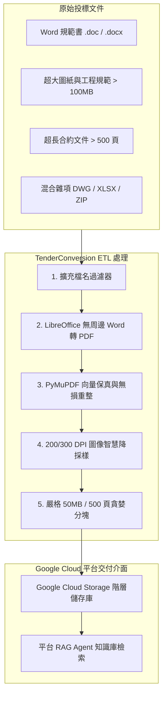

# 服務概覽：投標文檔 RAG ETL 數據管道 (Service Overview: Tender RAG ETL Pipeline)

**適用對象：** 全體人員 / 業務主管 / 投標專案經理 / 系統架構師
**文件狀態：** 現行版本
**最後審核：** 2026-10-05

> 備註：以下技術架構與雲端平台服務邊界於 2026 年 10 月 05 日審核此文檔時仍然有效。

---

## 簡要說明 (Summary)

本專案的核心定位為**專為大型投標文件設計的高保真 ETL（Extract-Transform-Load）數據預處理管道**。其主要目的在於將龐雜、多格式（.doc, .docx, .pdf）且往往高達數百 MB 至數 GB 的工程招標合約、工程規範及圖紙，自動化轉換為符合 **Google Cloud Agent Enterprise Platform**（原 Vertex AI Agent Builder / Enterprise Search）嚴格規範的標準化 PDF 資料集，以建立高品質的企業級 RAG 檢索知識庫（RAG Corpus / Data Store）。

---

## 為什麼需要本 ETL 管道？(Business & Technical Drivers)

在企業投標與合約管理過程中，導入生成式 AI 與 RAG Agent 面臨以下關鍵瓶頸：

1. **Google Cloud Agent Enterprise Platform 的硬性門檻：**
   - **單一文件大小上限：** 非結構化檔案（Unstructured Documents）置入 GCS 用於 Agent Builder 索引時，單檔上限通常為 **50 MB**（超過者將無法解析或被靜默跳過）。
   - **文件解析頁數上限：** 整合 Document AI 或進階版面配置解析器（Layout Parser）時，單一文件上限為 **500 頁**（超過 500 頁直接報錯拒絕索引）。
   - **格式限制：** Agent 平台的版面解析引擎無法直接攝取原始 Word 檔，必須轉化為標準 PDF。
2. **語意檢索（RAG）對文本可搜尋性（Searchability）的極致要求：**
   - 若直接將 PDF 轉為低解析度點陣圖，將喪失原生文本層，導致嵌入模型（Embedding）無法建立向量索引。
   - 本管道**完全保留原生文字（Native Text）、向量幾何圖形（Vector Drawings）、頁面幾何座標與旋轉角度**，僅針對超大點陣圖進行 200~300 DPI 智慧重整。
3. **目錄結構與語意關聯性保護：**
   - 投標文件通常劃分為 `Volume 1 - Contract`, `Volume 2 - General Specification`, `Volume 3 - Drawings` 等層級。本管道具備**目錄結構 100% 映射復刻**能力，使得檔案同步至 GCS 後，RAG Agent 能依據 GCS 檔案路徑進行精準的篩選條件（Facet / Metadata Filter）過濾。

---

## 服務邊界與系統職責 (Service Scope & Boundaries)

| 處理階段 | 本專案職責範圍 (In Scope) | 外部平台職責範圍 (Out of Scope / GCloud) |
|---|---|---|
| **前置篩選** | 掃描目錄、篩選 `.doc`, `.docx`, `.pdf`、保留原始子目錄階層 | 檔案伺服器權限管理、原始檔案備份 |
| **格式轉換** | 以無周邊 LibreOffice 將 Word 高保真轉為 PDF | Word 原始檔排版修正、缺字補正 |
| **體積最佳化** | PDF 物件無損去重重整（Flate 壓縮）、DPI 閾值偵測與精確重採樣 | 雲端 Document AI OCR 計費與辨識 |
| **規格約束** | 嚴格保證輸出檔案 **< 50.0 MB** 且 **<= 500 頁**，超限自動貪婪分割為 `chunk-1`, `chunk-2` | Google Cloud Storage 檔案儲存生命週期 |
| **品質驗證** | 文字層 Hash 雜湊比對、頁數/旋轉/框線不變性校驗、輸出檔數對齊斷言 | 向量嵌入生成（Vector Embedding）、RAG Agent 語意問答 |

---

## 核心價值與對營運的影響 (Operational Impact)

- **自動化減省人工：** 過去投標團隊需手動以 Adobe Acrobat 逐份拆分壓縮上百份合約與工程規範，動輒耗費數天且容易漏頁；現已縮短至數十分鐘全自動處理。
- **100% 雲端相容：** 經過本管道處理後之檔案，可直接一鍵 `gsutil rsync` 至 GCS Bucket，無需擔心因超大檔案或超長頁數導致 Agent 索引失敗或管線崩潰。
- **高檢索準確度：** 保留原生可選取文字與高解析度圖像，使 Google Cloud Agent 在回答工程規範查詢時具備高精準度引用能力。

---

## 現行環境與重要參數 (Current Specifications)

| 項目 | 預設參數值 | 說明 |
|---|---|---|
| **檔案大小上限 (`--max-mb`)** | `50.0 MB` | 嚴格符合 GCloud Agent Enterprise Platform 單檔極限 |
| **檔案頁數上限 (`--max-pages`)** | `500 頁` | 嚴格符合 Document AI / Layout Parser 上限 |
| **目標圖像解析度 (`--dpi`)** | `200 DPI` (建議 `300 DPI`) | 符合 OCR 辨識的最佳清晰度與檔案體積平衡點 |
| **降採樣觸發閾值 (`--dpi-threshold`)**| `1.5 x --dpi` (即 300~450 DPI) | 僅對過度冗餘的高解析掃描圖重採樣，不浪費運算資源 |
| **JPEG 壓縮品質 (`-q`)** | `80` | 保證工程圖紙文字與曲線無明顯失真 |
| **執行環境** | Docker 容器 (`python:3.12-slim`) | 包含 LibreOffice Writer、DejaVu/Liberation 字型庫 |

---

## 已知限制與待確認項目 (Pending Confirmations)

- **待確認：** 正式 Google Cloud 專案 ID（Project ID）與 Agent Enterprise Platform 應用程式實例名稱。
- **待確認：** 生產環境 GCS 接收儲存庫名稱（如 `gs://<company>-tender-rag-corpus/`）。
- **待確認：** 投標文件同步至 GCS 的觸發機制（現階段採手動批次同步或本機 Docker 輸出交付）。
- **待確認：** 企業內部負責審批投標文件進入 RAG Agent 知識庫之業務主管名單。

---

## 相關參考文件 (Related Topics)

- [返回根目錄導覽](../README.md)
- [概覽模組索引](Index.md)
- [Gcloud RAG Agent 限制與規範指引](../02-ETL-and-operations/02-RAG-spec-and-limits/Gcloud-rag-agent-constraints.md)
- [ETL 管道執行與 Docker 操作手冊](../02-ETL-and-operations/01-Pipelines/Pipeline-execution-and-docker-guide.md)
- [系統架構與 RAG 資料流設計](../03-Technical-reference/01-Architecture/System-architecture-and-data-flow.md)
