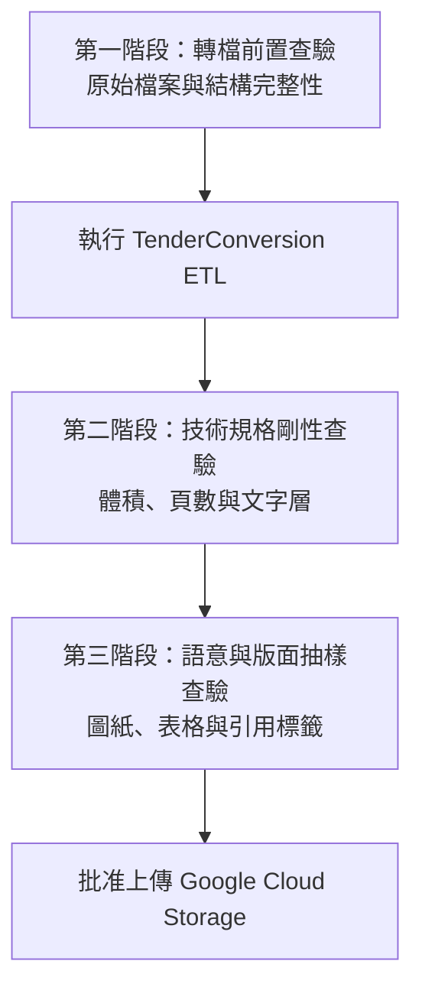

# 投標文件品質檢核與驗證清單 (Document Quality and Verification Checklist)

**適用對象：** 投標主管 / 品管人員 (QA) / 資料前置作業員 / 營運工程師
**文件狀態：** 現行版本
**最後審核：** 2026-10-05

> 備註：以下檢核標準，於 2026 年 10 月 05 日審閱本文件時仍然有效。

---

## 簡要說明 (Summary)

本文件提供將投標文件交付至 **Google Cloud Agent Enterprise Platform** 前的品質檢查清單。檢查分為轉檔前、轉檔後技術檢查，以及業務與版面抽查三個階段，協助確認文件符合本管道的輸出要求。平台端的實際限制仍須以目標環境為準。

---

## 三階段檢驗架構 (Three-Stage Verification Framework)

---

## 檢驗清單與操作標準 (Detailed Checklists)

### 第一階段：轉檔前置查驗 (Pre-Conversion Checklist)

將招標檔案交給 `filter_extensions.py` 或 `pdf_tender_pipeline.py` 前，請先確認：

- [ ] **無密碼保護：** 所有來源 `.pdf`、`.docx`、`.doc` 檔案均未設定開啟密碼或權限密碼（加密檔案將導致 LibreOffice 與 PyMuPDF 解析中斷）。
- [ ] **清理暫存鎖定檔：** 來源目錄中不得包含 Word 鎖定檔（檔名以 `~$` 開頭）。
- [ ] **目錄層級明確：** 招標合約目錄架構分明（例如 `Volume 1 - Contract/`, `Volume 2 - Specs/`），未有超過 10 層的異常深層目錄。
- [ ] **檔案名稱正規：** 檔案名稱中無控制字元、換行符號（`\n`）或特殊萬用字元（`*`, `?`, `|`）。

---

### 第二階段：技術規格剛性查驗 (Post-Conversion Technical Checklist)

ETL 管道執行完成後，請檢查以下技術項目：

| 檢驗項目 | 合格標準 | 驗證方式 | 處置方式 |
|---|---|---|---|
| **單一檔案體積** | 小於設定的大小上限（預設 `< 50.0 MB`） | 檢查 Step 3 驗證日誌，或在檔案總管查看檔案大小。 | 若仍有超標文件，檢查是否使用 `--no-chunk`，並依需求重新執行。 |
| **單一檔案頁數** | 不超過設定的頁數上限（預設 `500 頁`） | 檢查驗證日誌：`Largest page count <= 500 pages`。 | 若檔案超過設定上限，確認是否已啟用分塊。 |
| **原生文字層檢索** | 隨機抽樣 PDF 正文，文字必須可正常反白與複製。 | 在 Adobe Reader / Edge 瀏覽器中按 `Ctrl + F` 搜尋關鍵字，並複製文字貼至記事本。 | 若出現亂碼或無法反白，確認原始 Word 是否包含純點陣圖或字型未嵌入。 |
| **分塊連續性** | 切分檔案必須依序編號且無缺漏。 | 檢查檔名：`_chunk-1.pdf`, `_chunk-2.pdf` 頁碼範圍是否無縫銜接。 | 管道採交易性切分，若發現不連續請檢查磁碟空間並重新執行。 |
| **輸出數量檢查** | 輸出檔案數量符合預期；分塊時輸出數可能多於來源檔案數。 | 檢查 Step 5 日誌中的數量檢查結果。 | 若數量不符預期，查看日誌中的 `[FAIL]` 訊息。 |

---

### 第三階段：業務與版面語意抽驗 (Semantic & Layout QA Checklist)

由投標專案品管人員隨機抽查約 5% 至 10% 的輸出文件：

- [ ] **工程圖紙清晰度：** 將圖紙縮放至 100% 檢視，確認細小文字註記及管線編號仍可辨識。
- [ ] **表格結構無失真：** 標單與規範書中的複雜表格欄位未有斷裂或欄位重疊，線條清晰。
- [ ] **旋轉角度正常：** 橫向橫幅工程圖紙與直向規範書皆維持原始旋轉方向（`rotation` 保持不變），未發生全域 90 度偏轉。
- [ ] **超大單頁救援結果：** 若日誌顯示 `Oversized pages rescued`，請開啟相應頁面，確認圖紙內容是否仍可辨識。

---

## 缺陷嚴重度與退件標準 (Defect Severity Matrix)

| 嚴重等級 | 缺陷描述 | 處置行動 |
|---|---|---|
| **阻斷級 (Critical)** | 檔案超過目標環境設定的大小或頁數上限，或檔案損毀而無法開啟。 | **暫停上傳 GCS**，確認規格並修正後重新執行管道。 |
| **重大級 (Major)** | 原本含有文字的頁面（救援頁面除外）整頁轉為無法選取文字的圖片。 | 暫停交付，並請技術支援檢查處理結果。 |
| **一般級 (Minor)** | 圖像壓縮後出現輕微色差，但文字與線條仍可辨識。 | 依業務需求評估是否交付；必要時可提高 `-q` 至 85 至 90。 |

---

## 已知限制或待確認項目 (Pending Confirmations & Limitations)

- **待確認：** 企業正式驗收投標知識庫的指定簽核負責人（QA Lead）。
- **待確認：** 是否需針對特定投標專案建立「文字層覆蓋率自動檢測腳本」。

---

## 相關參考文件 (Related Topics)

- [返回營運分類索引](../Index.md)
- [Gcloud RAG Agent 限制規範](Gcloud-rag-agent-constraints.md)
- [常見問題與故障排除手冊](../04-Support/Troubleshooting-and-faq.md)
- [超大單頁應急點陣化救援機制筆記](../../03-Technical-reference/04-Feature-notes/Oversized-page-rescue-mechanism.md)
