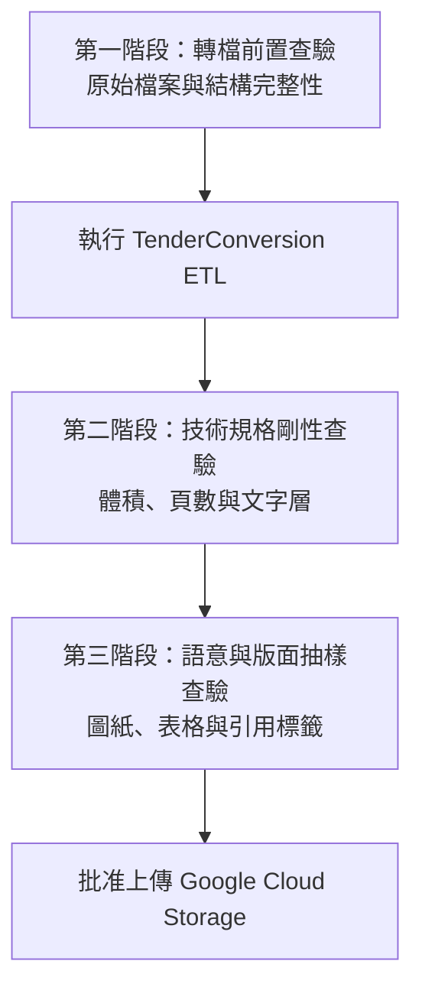

# 投標文件品質檢核與驗證清單 (Document Quality and Verification Checklist)

**適用對象：** 投標主管 / 品管人員 (QA) / 資料前置作業員 / 營運工程師
**文件狀態：** 現行版本
**最後審核：** 2026-10-05

> 備註：以下檢核標準於 2026 年 10 月 05 日審核此文檔時仍然有效。

---

## 簡要說明 (Summary)

本文件提供投標文件進入 **Google Cloud Agent Enterprise Platform** 知識庫（GCS 儲存庫與 RAG Agent）前的完整品質驗證清單。透過「轉檔前」、「轉檔後技術性」、「業務與版面語意」三階段檢驗，確保進入 RAG 知識庫的文件 100% 符合雲端系統門檻，並具備最高等級的文字可檢索性與回答準確度。

---

## 三階段檢驗架構 (Three-Stage Verification Framework)

---

## 檢驗清單與操作標準 (Detailed Checklists)

### 第一階段：轉檔前置查驗 (Pre-Conversion Checklist)

在將招標檔案送入 `filter_extensions.py` 或 `pdf_tender_pipeline.py` 之前，操作人員必須確認：

- [ ] **無密碼保護：** 所有來源 `.pdf`、`.docx`、`.doc` 檔案均未設定開啟密碼或權限密碼（加密檔案將導致 LibreOffice 與 PyMuPDF 解析中斷）。
- [ ] **清理暫存鎖定檔：** 來源目錄中不得包含 Word 鎖定檔（檔名以 `~$` 開頭）。
- [ ] **目錄層級明確：** 招標合約目錄架構分明（例如 `Volume 1 - Contract/`, `Volume 2 - Specs/`），未有超過 10 層的異常深層目錄。
- [ ] **檔案名稱正規：** 檔案名稱中無控制字元、換行符號（`\n`）或特殊萬用字元（`*`, `?`, `|`）。

---

### 第二階段：技術規格剛性查驗 (Post-Conversion Technical Checklist)

ETL 管道執行完成後，必須 100% 通過以下四項自動化與人工技術指標：

| 檢驗項目 | 合格標準 | 驗證方式 | 處置方式 |
|---|---|---|---|
| **單一檔案體積** | 嚴格 `< 50.0 MB` (無任何例外) | 檢查 Step 3 驗證日誌：`ALL CLEAR: All files are verified strictly under 50.0 MB.` 或於檔案總管排序檔案大小。 | 若有超標，檢查是否誤加 `--no-chunk`，重新執行管道分塊。 |
| **單一檔案頁數** | 嚴格 `<= 500 頁` | 檢查驗證日誌：`Largest page count <= 500 pages`。 | 管道預設會強制對超過 500 頁者分塊切分。 |
| **原生文字層檢索** | 隨機抽樣 PDF 正文，文字必須可正常反白與複製。 | 在 Adobe Reader / Edge 瀏覽器中按 `Ctrl + F` 搜尋關鍵字，並複製文字貼至記事本。 | 若出現亂碼或無法反白，確認原始 Word 是否包含純點陣圖或字型未嵌入。 |
| **分塊連續性** | 切分檔案必須依序編號且無缺漏。 | 檢查檔名：`_chunk-1.pdf`, `_chunk-2.pdf` 頁碼範圍是否無縫銜接。 | 管道採交易性切分，若發現不連續請檢查磁碟空間並重新執行。 |
| **總檔案數對齊** | 輸出合規檔案數必須完整覆蓋原始文件。 | 檢查 Step 5 斷言日誌：`ASSERTION PASSED: Output count matches input count.` | 若出現數量不一致，檢視日誌中的 `[FAIL]` 項目。 |

---

### 第三階段：業務與版面語意抽驗 (Semantic & Layout QA Checklist)

由投標專案品管人員進行 5%~10% 的隨機抽樣檢驗：

- [ ] **工程圖紙清晰度：** 圖紙上的細小文字註記、管線編號在縮放至 100% 時依然清晰可辨（得益於 200~300 DPI 與 JPEG 80 品質設定）。
- [ ] **表格結構無失真：** 標單與規範書中的複雜表格欄位未有斷裂或欄位重疊，線條清晰。
- [ ] **旋轉角度正常：** 橫向橫幅工程圖紙與直向規範書皆維持原始旋轉方向（`rotation` 保持不變），未發生全域 90 度偏轉。
- [ ] **超大單頁應急標記：** 若日誌顯示有 `Oversized pages rescued`，品管員需點開該頁確認工程圖紙是否尚可辨識。

---

## 缺陷嚴重度與退件標準 (Defect Severity Matrix)

| 嚴重等級 | 缺陷描述 | 處置行動 |
|---|---|---|
| **阻斷級 (Critical)** | 存在 `>= 50.0 MB` 或 `> 500 頁` 的檔案；或檔案損毀無法開啟。 | **立即禁止上傳 GCS**，修正參數後重新跑管線。 |
| **重大級 (Major)** | 原本有文字的頁面被整頁點陣化成無法選取文字的圖片（非救援頁面）。 | 檢查 PyMuPDF 不變性校驗機制，回報技術支援處理。 |
| **一般級 (Minor)** | 圖像壓縮後色彩有些微色差，但文字與線條完全可讀。 | 允許發佈至 GCS，必要時調高 `-q` 至 85~90。 |

---

## 已知限制或待確認項目 (Pending Confirmations & Limitations)

- **待確認：** 企業正式驗收投標知識庫的指定簽核負責人（QA Lead）。
- **待確認：** 是否需針對特定投標專案建立「文字層覆蓋率自動檢測腳本」。

---

## 相關參考文件 (Related Topics)

- [返回營運分類索引](../Index.md)
- [Gcloud RAG Agent 限制規範](Gcloud-rag-agent-constraints.md)
- [常見問題與故障排除手冊](../04-Support/Troubleshooting-and-faq.md)
- [超大單頁應急點陣化救援機制筆記](../../03-Technical-reference/04-Feature-notes/Oversized-page-rescue-mechanism.md)
