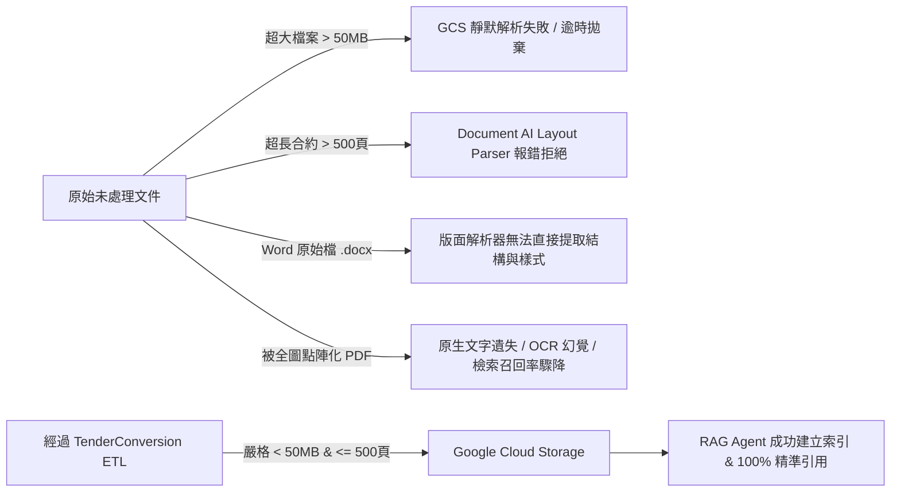

# Gcloud Agent Enterprise Platform GCS 與 RAG Agent 限制規範 (Gcloud RAG Agent Constraints)

**適用對象：** 系統架構師 / 投標專案經理 / 資料工程師 / 雲端維護人員
**文件狀態：** 現行版本
**最後審核：** 2026-10-05

> 備註：以下 Google Cloud Agent Enterprise Platform (Vertex AI Agent Builder / Search) 服務限制與 GCS 儲存規格於 2026 年 10 月 05 日審核此文檔時仍然有效。

---

## 簡要說明 (Summary)

本文件詳盡規範將投標文檔導入 **Google Cloud Agent Enterprise Platform**（涵蓋 Vertex AI Agent Builder、Enterprise Search、RAG Corpus 與 GCS 儲存庫）時所面臨的各項技術門檻與邊界限制。同時深入闡述本 ETL 管道各項預設參數（如 50MB 檔案大小、500 頁頁數、200/300 DPI 解析度）如何精準對齊這些雲端平台規範，確保投標文件在進入 GCS 後能 100% 被 RAG Agent 成功索引與精確檢索。

---

## 為什麼需要嚴格遵守雲端平台限制？(The "Why")

在 GCloud Agent Enterprise Platform 的架構中，GCS 儲存與 RAG Agent 檢索庫對非結構化文件（Unstructured Documents）有明確的攝取門檻。若未經 ETL 預先處理而直接上傳原始投標文件，將觸發以下嚴重後果：



---

## Google Cloud 限制規範與 ETL 處置對照矩陣 (Constraint Matrix)

| 雲端維度 | Google Cloud 平台限制 / 建議值 | 違規之後果 | TenderConversion ETL 的對應處置機制 |
|---|---|---|---|
| **單一檔案體積 (File Size)** | 非結構化文件單檔上限：**50.0 MB** (特殊設定上限至多 100MB，但 50MB 為最具穩定性與索引效能門檻) | 超過 50MB 的 PDF 在 Agent Builder 建立索引時會觸發 `RESOURCE_EXHAUSTED`、逾時或被靜默忽略。 | 管道內建 `--max-mb 50.0`，先進行 Flate 無損重整與圖像重編碼；若仍超標，則啟動**精準位元組貪婪分塊**，保證每個輸出分塊嚴格 `< 50.0 MB`。 |
| **文件總頁數 (Page Count)** | Document AI / 進階版面配置解析器單次解析上限：**500 頁** | 超過 500 頁的文件會被 Document AI 拒絕處理，導致整份標案無法建立表格結構與版面層級。 | 管道內建 `--max-pages 500`，即便檔案小於 50MB，只要頁數超過 500 頁，即強制切分為 `chunk-1`, `chunk-2` 等合規檔案。 |
| **檔案格式支援 (File Format)** | 支援 PDF、HTML、TXT、CSV。**Word (.doc/.docx) 不受版面解析器原生支援**。 | 原始 Word 檔案無法完整保留頁首頁尾、工程圖紙排版、表格樣式與欄位拓撲。 | 管道於第一步驟透過無周邊 LibreOffice 自動將所有 `.doc` 與 `.docx` 高保真轉換為具備可選取文字層之標準 PDF。 |
| **文字層可搜尋性 (Text Layer)** | RAG Agent 向量嵌入模型必須讀取文字字串。 | 若將文件整頁壓制成圖片（Rasterization），文字層將被摧毀，需依賴昂貴且易出錯的二次 OCR，降低問答準確率。 | 壓縮程序採用幾何與語意不變性校驗（`_document_invariants`），比對文字 SHA-256 雜湊，**嚴格禁止破壞原生文字與向量幾何圖案**。 |
| **圖像與 OCR 解析度 (DPI)** | Document AI OCR 官方建議解析度：**200 ~ 300 DPI**。 | 低於 150 DPI 會導致細小標註模糊辨識失敗；高於 400 DPI 會導致檔案急遽膨脹且無益於辨識。 | 管道設定目標 `--dpi 200`（建議最高 300），閾值 `--dpi-threshold` 設為 1.5 倍，僅對過度冗餘的高解析掃描圖重採樣。 |
| **單一超大頁面救援 (Oversized Page)** | 極少數 A0/A1 建築全區圖紙單頁體積即超過 50MB。 | 貪婪分塊演算法無法將單一頁面切為更小單位，會卡死在單頁上限。 | 內建**超大單頁點陣化救援機制**（`_rescue_oversized_page`），僅針對該特定頁面依序嘗試 180->150->120->96->72->50 DPI 階梯式點陣化，直至壓入 50MB。 |
| **GCS URI 階層與元數據 (Hierarchy)** | Agent Builder 支援利用 GCS Object URI 作為過濾條件（Facet Filter）。 | 若將檔案攤平上傳，RAG Agent 無法按標案冊別（Volume / Addendum）進行精準範圍限定。 | 管道維持相對路徑階層複製，輸出時 100% 映射來源目錄，使 GCS URI 具備清楚的標案結構。 |

---

## 關鍵技術細節深入剖析 (Deep Dive)

### 1. 為什麼是 50 MB 與 500 頁？
在 Google Cloud Agent Enterprise Platform 中：
- **索引延遲與切片（Chunking）：** Agent Builder 會在後台將 PDF 拆解為語意 Chunk（例如 500 tokens 一個 chunk，附帶 100 tokens 重疊）。當一個 PDF 超過 50MB 時，後台解析 Pod 容易發生 OOM（Out Of Memory）或超出 API 逾時閥值（600 秒）。
- **Document AI 限制：** 企業搜尋的「進階文件解析器（Layout Parser）」具備深度表格識別與關聯分析能力，其硬性配額上限即為 500 頁。若將 1500 頁的完整標案未切分直接送入，整份文件將直接被標記為失敗。

### 2. 貪婪分塊的命名與引用連續性 (Chunk Naming Standard)
當檔案因超標而被分割時，管道採用國際標準的連續序號命名：
```text
原始檔案：
V3_02 - SCOPE (Drawings) - GENERAL ARRANGEMENT (GA)_Combined.pdf (126.5 MB, 60 頁)

分割產出：
├── V3_02 - ... - GENERAL ARRANGEMENT (GA)_Combined_chunk-1.pdf (第 1~24 頁, 48.7 MB)
├── V3_02 - ... - GENERAL ARRANGEMENT (GA)_Combined_chunk-2.pdf (第 25~41 頁, 47.9 MB)
└── V3_02 - ... - GENERAL ARRANGEMENT (GA)_Combined_chunk-3.pdf (第 42~60 頁, 29.8 MB)
```
- **對 RAG Agent 的好處：** Agent 在檢索到答案時，引用的來源檔名會明確顯示 `chunk-1`，且分塊在同一目錄下，AI 可以提示使用者答案來自該標案的第幾分冊前段。

### 3. GCS 物件命名與編碼限制
當文件準備上傳至 Google Cloud Storage 時，請確保遵循以下命名原則：
- **編碼：** 必須為合法的 UTF-8 字串。
- **長度：** 物件名稱（包含路徑前綴）不得超過 1024 位元組。
- **避免特殊字元：** 避免在檔名或資料夾名稱中使用控制字元、換行符號（`\n`, `\r`）或萬用字元（`*`, `?`, `[`）。本 ETL 管道產出之檔案名稱完全相容於 GCS 物件命名標準。

---

## 營運檢驗標準 (Operational Acceptance Criteria)

在將文件批准上傳至 Google Cloud Storage 之前，品管人員必須驗證：

1. **體積合規率 100%：** 輸出資料夾中所有 `.pdf` 檔案大小均 `< 50.0 MB`。
2. **頁數合規率 100%：** 輸出資料夾中所有 `.pdf` 檔案頁數均 `<= 500 頁`。
3. **無損文字層：** 在 PDF 檢視器（如 Acrobat 或 Edge）中開啟檔案，正文文字必須能正常反白選取與複製。
4. **目錄結構一致：** 輸出資料夾之樹狀圖必須與原始招標目錄保持同構（Isomorphic）。

---

## 已知限制或待確認項目 (Pending Confirmations & Limitations)

- **待確認：** 企業選用的 Google Cloud Agent Enterprise Platform 版本（Standard 版或 Enterprise 版），不同版本可能影響進階版面解析的每分鐘請求配額（QPM）。
- **待確認：** 是否已在 Google Cloud Console 中為目標 RAG Data Store 啟用「進階版面配置解析（Advanced Document Layout Parser）」。

---

## 相關參考文件 (Related Topics)

- [返回營運分類索引](../Index.md)
- [ETL 管道執行與 Docker 操作手冊](../01-Pipelines/Pipeline-execution-and-docker-guide.md)
- [投標文件品質檢核與驗證清單](Document-quality-and-verification-checklist.md)
- [GCS 儲存拓撲與同步指引](../../03-Technical-reference/02-GCP-and-rag-integration/Gcs-storage-topology-and-sync.md)
- [Vertex Agent Enterprise Search 整合規範](../../03-Technical-reference/02-GCP-and-rag-integration/Vertex-agent-enterprise-search-setup.md)
