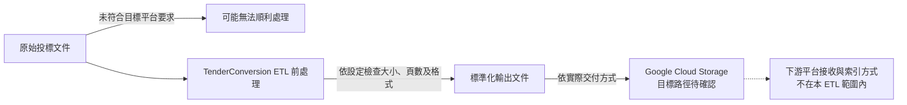

# Gcloud Agent Enterprise Platform GCS 與 RAG Agent 限制規範 (Gcloud RAG Agent Constraints)

**適用對象：** 系統架構師 / 投標專案經理 / 資料工程師 / 雲端維護人員
**文件狀態：** 現行版本
**最後審核：** 2026-10-05

> 備註：以下 Google Cloud Agent Enterprise Platform（Vertex AI Agent Builder / Search）服務限制與 GCS 儲存規格，於 2026 年 10 月 05 日審閱本文件時仍然有效。

---

## 簡要說明 (Summary)

本文件整理將投標文件交付至 **Google Cloud Agent Enterprise Platform** 時應注意的技術限制，並說明 ETL 管道如何依照檔案大小、頁數及解析度等設定處理輸入資料。平台服務與設定可能因環境而異；正式交付前，請先與目標環境的實際規格核對。

---

## 為什麼要先確認平台限制？(The "Why")

GCloud Agent Enterprise Platform 對非結構化文件的處理能力，會受到服務類型及設定影響。若未先檢查原始投標文件，可能遇到以下問題：



---

## Google Cloud 限制規範與 ETL 處置對照矩陣 (Constraint Matrix)

| 檢查項目 | 管道預設值或需確認的設定 | 可能影響 | TenderConversion ETL 的處理方式 |
|---|---|---|---|
| **單一檔案大小 (File Size)** | 管道預設門檻為 **50.0 MB**；平台實際上限須依目標服務與設定確認。 | 超出目標環境限制的文件可能無法成功處理。 | 管道以 `--max-mb 50.0` 設定門檻，先嘗試重整與圖像重編碼；若仍超標，再進行分塊。 |
| **文件頁數 (Page Count)** | 管道預設門檻為 **500 頁**；平台實際上限須依目標服務與設定確認。 | 超出目標環境限制的文件可能無法成功處理。 | 管道以 `--max-pages 500` 設定門檻；超過頁數限制時會切分為 `chunk-1`、`chunk-2` 等檔案。 |
| **檔案格式支援 (File Format)** | 本管道會將 `.doc` 與 `.docx` 轉換為 PDF；目標平台支援的格式請依平台文件確認。 | 格式不符目標平台要求時，文件可能無法按預期處理。 | 管道使用無周邊 LibreOffice 將 `.doc` 與 `.docx` 轉換為 PDF。 |
| **文字層可搜尋性 (Text Layer)** | 保留原生文字層有助於後續文字擷取。 | 若整頁轉為點陣圖，該頁將不再含有可搜尋的原生文字；後續是否執行 OCR，取決於平台設定。 | 壓縮程序使用 `_document_invariants` 檢查文字 SHA-256 雜湊及頁面幾何資訊，避免一般重整流程改變原始文字與版面。 |
| **圖像與 OCR 解析度 (DPI)** | 管道預設目標為 `--dpi 200`；其他處理需求請依來源文件及平台設定調整。 | 解析度過低可能影響小字辨識；過高則可能增加檔案大小。 | 管道以 `--dpi-threshold` 判斷是否對高解析度點陣圖重採樣。 |
| **單一超大頁面救援 (Oversized Page)** | 單一頁面本身可能超出設定的檔案大小門檻。 | 分塊以頁為單位，無法再將單頁切成更小的頁面範圍。 | `_rescue_oversized_page` 會依序嘗試 180、150、120、96、72、50 DPI 的點陣化設定，直到符合大小門檻或所有設定都嘗試完畢。 |
| **GCS 路徑與目錄結構 (Hierarchy)** | 本管道會保留來源的相對目錄結構。 | 若交付時將檔案攤平，來源資料夾資訊也會隨之減少。 | 依來源目錄輸出文件，方便後續維護及追溯；平台是否使用 GCS URI 作為篩選條件，取決於下游設定。 |

---

## 技術細節 (Technical Details)

### 1. 管道預設門檻
平台服務的檔案大小與頁數限制，會依採用的產品、解析器及設定而異。因此，本管道提供 `--max-mb` 與 `--max-pages` 參數，讓維護人員依目標環境設定輸出門檻。請勿將本文列出的預設值視為適用於所有平台配置的保證。

### 2. 貪婪分塊的命名與引用連續性 (Chunk Naming Standard)
當檔案超過管道設定的門檻而需要分塊時，檔名會依序加上分塊編號：
```text
原始檔案：
V3_02 - SCOPE (Drawings) - GENERAL ARRANGEMENT (GA)_Combined.pdf (126.5 MB, 60 頁)

分割產出：
├── V3_02 - ... - GENERAL ARRANGEMENT (GA)_Combined_chunk-1.pdf (第 1~24 頁, 48.7 MB)
├── V3_02 - ... - GENERAL ARRANGEMENT (GA)_Combined_chunk-2.pdf (第 25~41 頁, 47.9 MB)
└── V3_02 - ... - GENERAL ARRANGEMENT (GA)_Combined_chunk-3.pdf (第 42~60 頁, 29.8 MB)
```
- **方便追溯來源：** 分塊檔案沿用原始檔名並附加序號，且保留於對應目錄中，方便管理者辨識文件來源。

### 3. GCS 物件命名與編碼限制
當文件準備上傳至 Google Cloud Storage 時，請確保遵循以下命名原則：
- **編碼：** 必須為合法的 UTF-8 字串。
- **長度：** 物件名稱（包含路徑前綴）不得超過 1024 位元組。
- **避免特殊字元：** 避免在檔名或資料夾名稱中使用控制字元、換行符號（`\n`、`\r`）或萬用字元（`*`、`?`、`[`）。交付前請確認輸出檔名符合目標環境的命名要求。

---

## 營運檢驗標準 (Operational Acceptance Criteria)

上傳至 Google Cloud Storage 前，請依照目標環境的規格確認：

1. **檔案大小：** 確認所有 `.pdf` 均符合 `--max-mb` 設定（預設 `50.0 MB`）。
2. **頁數：** 確認所有 `.pdf` 均符合 `--max-pages` 設定（預設 `500 頁`）。
3. **文字層：** 在 PDF 檢視器（如 Acrobat 或 Edge）中確認一般處理頁面的文字可反白及複製。超大單頁救援頁面會轉為點陣圖，不適用此項檢查。
4. **目錄結構：** 確認輸出資料夾保留來源文件的相對路徑。

---

## 已知限制或待確認項目 (Pending Confirmations & Limitations)

- **待確認：** 目標 Google Cloud Agent Enterprise Platform 服務與設定，以及適用的檔案大小和頁數限制。
- **待確認：** 目標環境是否使用進階版面配置解析器，以及該解析器的實際規格。

---

## 相關參考文件 (Related Topics)

- [返回營運分類索引](../Index.md)
- [ETL 管道執行與 Docker 操作手冊](../01-Pipelines/Pipeline-execution-and-docker-guide.md)
- [投標文件品質檢核與驗證清單](Document-quality-and-verification-checklist.md)
- [GCS 儲存拓撲與同步指引](../../03-Technical-reference/02-GCP-and-rag-integration/Gcs-storage-topology-and-sync.md)
- [Vertex Agent Enterprise Search 整合規範](../../03-Technical-reference/02-GCP-and-rag-integration/Vertex-agent-enterprise-search-setup.md)
