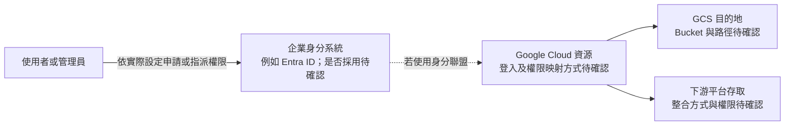

# 企業身分識別與 GCS 存取授權指引 (Enterprise Identity and GCS Access Guide)

**適用對象：** 企業 IT 管理員 / 資安主管 / 投標專案負責人 / 雲端維運工程師
**文件狀態：** 現行版本
**最後審核：** 2026-10-05

> 備註：以下身分驗證整合架構與管理員指派路徑，於 2026 年 10 月 05 日審閱本文件時仍然有效；實際設定請以企業環境為準。

---

## 簡要說明 (Summary)

本指引說明在企業採用 **Microsoft Entra ID（前稱 Azure AD）** 與 **Google Cloud Platform（GCP）** 身分聯盟的情境下，如何理解單一登入（SSO）及權限指派流程。實際的帳號開通方式取決於企業的身分架構：部分權限可能由 Entra ID 管理，GCP 資源權限則仍須依企業設定透過 IAM 或相關聯盟機制授予。

---

## 核心身分架構：Entra ID 與 Google Cloud 聯盟模式 (Identity Architecture)

以下僅為身分與資源管理的概念示意，不代表本專案已採用其中任何一種整合方式。請先確認實際使用的身分提供者、登入協定及 GCP 權限設定：



### 權限申請時應確認的事項
- 先確認目標服務實際採用的登入方式，以及人員或群組由哪個系統管理。
- 若權限是透過 Entra ID 企業應用程式指派，請由具備相應權限的管理員在 Entra 管理中心處理；GCP 資源存取仍可能需要另外設定 IAM 權限。

---

## 管理員授權直達路徑 (Entra ID User Assignment Quick Link)

若企業確認使用 Entra ID 企業應用程式指派權限，且已提供相關識別資訊，管理員可依下列格式建立使用者與群組清單的直達連結：

> 🔗 **Entra ID 使用者與群組名單直達連結（ManagedApp Users Blade）：**
> `https://entra.microsoft.com/#view/Microsoft_AAD_IAM/ManagedAppMenuBlade/~/Users/objectId/<SERVICE_PRINCIPAL_OBJECT_ID>/appId/<APP_ID>/`
> *(請將 `<SERVICE_PRINCIPAL_OBJECT_ID>` 與 `<APP_ID>` 替換為企業提供的值；勿在文件中記錄 Tenant ID 或 Client Secret。)*

### Entra ID 企業應用程式指派步驟（僅適用於已採用此方式的環境）

1. **登入入口：** 瀏覽並登入 [Microsoft Entra admin center](https://entra.microsoft.com/)。
2. **進入企業應用程式：** 於左側導覽列展開 **Identity (身分)** > **Applications (應用程式)** > **Enterprise applications (企業應用程式)**。
3. **搜尋企業應用程式：** 在搜尋框輸入企業提供的應用程式名稱；目前正式名稱為**待確認**。
4. **進入使用者清單：** 點擊進入該應用程式，點選左側選單的 **Users and groups (使用者與群組)**。
5. **指派使用者或群組：**
   - 點選上方 **+ Add user/group (新增使用者/群組)**。
   - 搜尋同仁姓名或企業群組，並依企業權限政策選擇合適對象。
   - 若畫面提供角色選項，請依企業權限規劃選取，再點選 **Assign (指派)**。

---

## Google Cloud IAM 角色映射對照表 (GCP IAM Role Mapping)

下表僅作為角色規劃範例。實際角色、群組及權限映射須依企業的 Entra ID 與 GCP 設定確認，不能僅憑表格假設已完成配置：

| 業務角色 | Entra ID 應用角色 | Google Cloud IAM 角色 | 存取範圍 |
|---|---|---|---|
| **投標資料管理員** | 依企業設定 | 依需求授予 GCS 與平台角色 | 權限範圍應由管理者依工作需求設定。 |
| **投標工程師 (維運)** | 依企業設定 | 依需求授予 GCS 與平台角色 | 權限範圍應由管理者依工作需求設定。 |
| **一般終端使用者** | 依企業設定 | 依需求授予平台存取權限 | 可用功能及資料範圍取決於平台設定。 |
| **自動化同步服務** | 依企業設定 | 依需求授予 GCS 存取權限 | 使用專用身分執行批次同步；具體方式依自動化環境而定。 |

---

## 本機同步工具憑證指引 (Service Account Credentials for CLI Sync)

若需使用 `gcloud` 或 `gsutil` 將處理後的資料夾同步至 GCS，請依企業授權政策設定憑證：

1. **互動式本機作業：** 依組織政策登入並設定 Application Default Credentials（ADC），例如：
   ```powershell
   gcloud auth login --update-adc
   ```
2. **自動化批次作業：** 優先使用組織核准的無金鑰身分驗證方式，避免在程式碼或文件中儲存服務帳戶金鑰。

---

## 已知限制或待確認項目 (Pending Confirmations & Limitations)

- **待確認：** 企業 Microsoft Entra ID 專屬 Enterprise Application 的正式名稱與 Application ID (`<APP_ID>`)。
- **待確認：** 負責審批新增資料或平台存取權限的 IT 窗口。
- **待確認：** Google Cloud 接收端 GCS Bucket 的確切路徑（例如：`gs://corp-tender-rag-production/`）。
- **資安注意事項：** **請勿在 SharePoint 文件或程式碼中記錄企業目錄租戶 ID（Tenant ID）或私密金鑰（Private Key）**。

---

## 相關參考文件 (Related Topics)

- [返回營運分類索引](../Index.md)
- [雲端資源與運算成本分析](Cloud-resource-and-operating-costs.md)
- [GCS 儲存拓撲與同步指引](../../03-Technical-reference/02-GCP-and-rag-integration/Gcs-storage-topology-and-sync.md)
- [Vertex Agent Enterprise Search 整合規範](../../03-Technical-reference/02-GCP-and-rag-integration/Vertex-agent-enterprise-search-setup.md)
