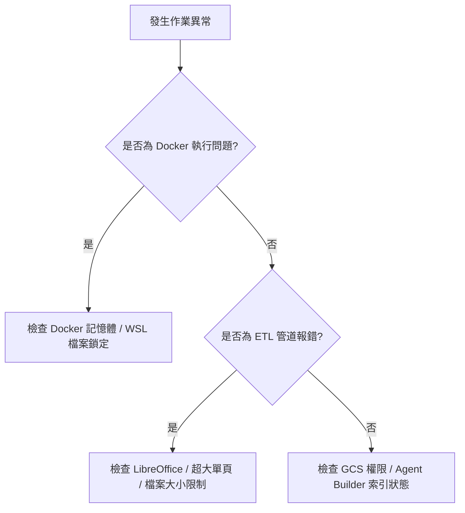

# 常見問題與故障排除手冊 (Troubleshooting and FAQ Guide)

**適用對象：** 全體操作人員 / 投標工程師 / 技術支援團隊 / 營運管理員
**文件狀態：** 現行版本
**最後審核：** 2026-10-05

> 備註：以下障礙現象、錯誤代碼與排查指引於 2026 年 10 月 05 日審核此文檔時仍然有效。

---

## 簡要說明 (Summary)

本文件彙整在執行投標文檔 ETL 轉檔、Docker 容器作業、以及將成果同步至 Google Cloud Agent Enterprise Platform (GCS / RAG Agent) 過程中可能遭遇之常見錯誤、警示訊息與對應排除 SOP。

---

## 快速故障排查決策樹 (Troubleshooting Decision Tree)



---

## 常見問題與故障排除矩陣 (Troubleshooting Matrix)

### 1. Docker 與本機檔案系統問題 (Docker & Filesystem Issues)

#### Q1: 在 Windows / WSL 執行 Docker 時出現 `File exists` 錯誤或目錄無法刪除？
- **根本原因：** 這是 Windows 與 WSL2 共享磁碟目錄（`/data` 掛載）之間常見的快取同步延遲或 Windows 搜尋索引服務（Search Indexer）鎖定目錄所致。
- **處置步驟：**
  1. 使用專用的暫存容器強制清理目標輸出目錄：
     ```powershell
     docker run --rm -v "${PWD}/data:/data" python:3.12-slim python -c "import shutil; shutil.rmtree('/data/MyTender_Final', ignore_errors=True)"
     ```
  2. 若仍被鎖定，確認本機未有任何 Adobe Acrobat、Word 或檔案總管開啟該目標資料夾中的檔案。

#### Q2: 執行加上 `--skip-copy` 後，輸出資料夾空空如也或只有幾份檔案？
- **根本原因：** 這是正常預期行為。`--skip-copy` 的核心設計是為了在慢速網路磁碟上極速運作，因此**只會將經過壓縮或分塊處理的超標檔案寫入輸出資料夾**；原本就小於 50MB 且小於 500 頁的合規檔案會留在來源目錄中。
- **處置步驟：**
  - 若需要完整的投標成果目錄，請移除 `--skip-copy` 重新執行。
  - 或者將輸出目錄中切分好的分塊檔案，手動覆蓋回原本的來源資料夾中。

---

### 2. 轉檔與分塊運算問題 (Pipeline & Chunking Issues)

#### Q3: 壓縮後檔案反而比原本「稍微變大」？
- **根本原因：** 某些原本就已經過高度最佳化的小型 PDF（例如早已經過低解析度 JPEG 壓縮的掃描件），若重新解開並以標準 Flate 串流封裝，其元數據與物件串流表結構可能微幅增加幾十 KB。
- **處置機制：**
  - 管道內建「最小有效候選檔案（Smallest Valid Result）」機制，會自動比對原始檔與壓縮後檔案，**若壓縮後變大，管道會自動捨棄重編碼結果，保留原始最小檔案**。
  - 此外，未超過 50MB 的檔案預設根本不會進入重編碼流程。

#### Q4: 遭遇 `Oversized pages rescued` 警告訊息，是什麼意思？
- **根本原因：** 某份投標文件中的「單一頁面」（例如全區超大高精細向量景觀圖）本身在未切分前就已經超過 50.0 MB。由於單一頁面無法再以頁為單位切分，貪婪算法無法將其放入任何分塊中。
- **處置機制：**
  - 管道會自動啟動「超大單頁應急點陣化救援機制」（`_rescue_oversized_page`），將該特定頁面依序以降階 DPI（180 -> 150 -> 120 -> 96 -> 72 -> 50 DPI）點陣化壓縮，直到體積成功壓入 50MB 門檻之內。
  - **注意事項：** 該特定頁面會轉為點陣圖，文字搜尋能力在該頁會受限，但保證了整份合約能順利進入 RAG 知識庫而不被中斷。

#### Q5: 本機 Python 執行時報錯 `LibreOffice is not installed or not in system PATH`？
- **處置步驟：**
  - 強烈建議直接改用 Docker Compose 執行（容器內已包含完整 LibreOffice 環境）。
  - 若堅持本機執行且輸入資料夾全是 PDF，請務必加上 `--pdf-only` 旗標以跳過 Word 轉換階段。

---

### 3. Google Cloud 與 RAG Agent 整合問題 (Cloud & RAG Issues)

#### Q6: 上傳至 GCS 後，Vertex AI Agent Builder 顯示文件解析警告或失敗？
- **處置步驟：**
  1. **檢查大小：** 確認該失敗檔案是否剛好落在 50.0 MB 邊界上。本管道輸出之分塊均嚴格小於 50.0 MB。
  2. **檢查頁數：** 確認是否有未經管線處理之檔案頁數超過 500 頁。
  3. **檢查密碼：** 確認該 PDF 是否被來源機關加蓋唯讀密碼，導致 Document AI 無法剖析。
  4. **檢查路徑字元：** 確認 GCS 物件路徑中是否含有特殊跳脫符號。

#### Q7: RAG Agent 在回答時找不到某個分冊的資訊？
- **處置步驟：**
  1. 檢查原始目錄在執行 `filter_extensions.py` 時，該分冊是否因為副檔名非 `.pdf` / `.docx`（例如被打包在 `.zip` 內）而被過濾掉。
  2. 檢查 Agent Builder 索引更新排程是否已完成最新批次資料同步（通常需耗時 10~30 分鐘）。

---

## 異常回報與技術支援升級路徑 (Escalation Path)

若遭遇無法排除的管線異常，請依循以下路徑提供資訊給技術維護團隊：

1. **收集日誌資訊：** 保留終端機完整的 Console 輸出文字（包含 `STARTING PIPELINE` 至 `SUMMARY STATISTICS`）。
2. **標記問題檔案：** 記錄出錯之特定檔案名稱、原始體積大小與頁數。
3. **聯繫內部窗口：**
   - **投標業務支援負責人：** 待確認
   - **DevOps / 雲端維運團隊：** 待確認
   - **問題通報郵箱：** 待確認

---

## 相關參考文件 (Related Topics)

- [返回營運分類索引](../Index.md)
- [ETL 管道執行與 Docker 操作手冊](../01-Pipelines/Pipeline-execution-and-docker-guide.md)
- [Gcloud RAG Agent 限制規範](../02-RAG-spec-and-limits/Gcloud-rag-agent-constraints.md)
- [投標文件品質檢核與驗證清單](../02-RAG-spec-and-limits/Document-quality-and-verification-checklist.md)
