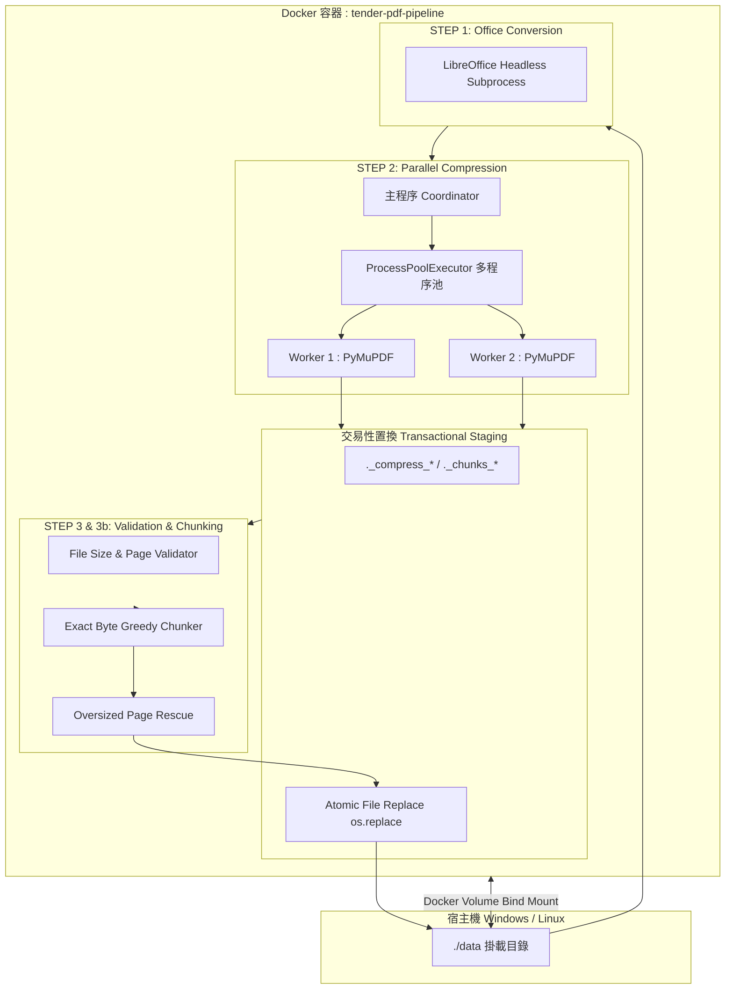

# 系統架構與 RAG 資料流設計 (System Architecture and RAG Data Flow)

**適用對象：** 系統架構師 / 後端工程師 / DevOps 工程師
**文件狀態：** 現行版本
**最後審核：** 2026-10-05

> 備註：以下系統架構與資料流拓撲於 2026 年 10 月 05 日審核此文檔時仍然有效。

---

## 簡要說明 (Summary)

本文件深入解析 `TenderConversion` ETL 管道的系統內部架構、程序的隔離機制（Process-level Parallelism）、暫存目錄生命週期管理與交易性置換（Transactional Replacement）設計。說明管道如何確保在面對數千份超大招標檔案時，兼具高吞吐量運算效能與零檔案毀損的強健性。

---

## 系統整體拓撲與組件分層 (System Topology)



---

## 核心架構設計特點 (Core Architectural Highlights)

### 1. 程序級並行模型 (Process-Level Parallelism vs Threading)
- **架構決策：** 管道未採用多執行緒（Multi-threading），而是採用多程序架構（`concurrent.futures.ProcessPoolExecutor`）。
- **原因深入：** PyMuPDF 底層基於 C 語言 MuPDF 函式庫，雖然部分運算釋放 GIL，但在執行重度圖像解壓縮、重編碼與頁面樹操作時，多執行緒仍存在 GIL 爭用；更甚者，大型 PDF 剖析涉及龐大的 C 堆疊記憶體，若單一執行緒崩潰會波及整個進程。
- **程序隔離：** 每個 Worker 程序獨立接收一個 PDF 任務，擁有專屬的記憶體位址空間，完成後將摘要結果字典回傳主程序。主程序負責派工與統計，確保單檔異常不會導致整個批次失敗。

### 2. 暫存目錄生命週期與防污染設計 (Staging Lifecycle)
在大型批次轉檔過程中，最忌諱暫存檔污染來源目錄或被後續步驟誤判：
- **前綴標記機制：** 管道中所有暫存目錄均以小數點開頭並帶有專屬標記：
  - 壓縮暫存：`._compress_`
  - 分塊暫存：`._chunks_`
  - 批次執行暫存：`.run_`
  - 備份暫存：`.backup_`
- **掃描隔離（`_discover_pdfs`）：** 在遍歷目錄探索 PDF 時，透過 `_is_pipeline_temp_dir_name` 函式將所有帶有上述標記的目錄直接在遍歷清單中剔除（`directory_names[:] = [...]`），確保管線永遠不會讀取或重複處理未完成的半成品。

### 3. 原子性交易置換 (Atomic Transactional Replacement)
為防止在寫入大檔案時發生當機或中斷導致檔案損毀：
- **雙階段提交：** 任何壓縮或切分後的 PDF，均先完整寫入同一檔案系統下的暫存路徑（例如 `stage_dir / "publish.pdf"`）。
- **原子替換（`os.replace`）：** 在檔案完全寫入並確認校驗無誤後，透過作業系統原生的 `os.replace` 進行原子置換。在 POSIX 及現代 Windows NTFS 檔案系統上，此操作為不可分割的原子操作，保證目標路徑若存在檔案，該檔案必定是 100% 寫入完成的有效 PDF。

---

## 資料流階段細節 (Data Flow Stages)

```text
[原始目錄 Raw Folder]
   │
   ├── (Step 1) 遞迴搜尋 .doc / .docx
   │      └── 調用 libreoffice --headless --convert-to pdf
   │
   ├── (Step 2) 掃描所有 .pdf 檔案
   │      ├── <= 50.0 MB 且 <= 500 頁 ──► [直接複製 (除非 --skip-copy)]
   │      └── > 50.0 MB ──► [分配至 Worker 進行無損重整與圖像降採樣]
   │
   ├── (Step 3) 驗證所有 PDF 大小與頁數
   │      ├── 全部合規 (<50MB & <=500頁) ──► [進入 Step 4]
   │      └── 存在超標檔案 ──► [進入 Step 3b 貪婪分塊]
   │
   ├── (Step 3b) 精確貪婪切分
   │      ├── 計算連續頁面序列化位元組
   │      ├── 切分產生 _chunk-1.pdf, _chunk-2.pdf
   │      └── 若遇超大單頁 ──► [啟動 _rescue_oversized_page 點陣化救援]
   │
   └── (Step 4 & 5) 摘要統計與檔案數斷言驗證 ──► [輸出合規資料庫]
```

---

## 已知限制或待確認項目 (Pending Confirmations & Limitations)

- **待確認：** 生產環境伺服器之 CPU 核心數與 RAM 大小（預設 `workers` 取 2 與核心數之較小值；若主機具備 16 核心與 32GB RAM，可手動指定 `--workers 4` 或 `6` 提升吞吐量）。
- **系統限制：** Docker 掛載 Windows 磁碟在超大檔案 I/O 頻繁時可能受限於 9P/VirtioFS 傳輸速率，建議在容器本地 SSD 進行轉檔後再搬移成果。

---

## 相關參考文件 (Related Topics)

- [返回技術分類索引](../Index.md)
- [無損重整、圖像降採樣與貪婪分塊算法](Compression-and-chunking-algorithms.md)
- [GCS 儲存拓撲與同步指引](../02-GCP-and-rag-integration/Gcs-storage-topology-and-sync.md)
- [超大單頁應急點陣化救援機制筆記](../04-Feature-notes/Oversized-page-rescue-mechanism.md)
