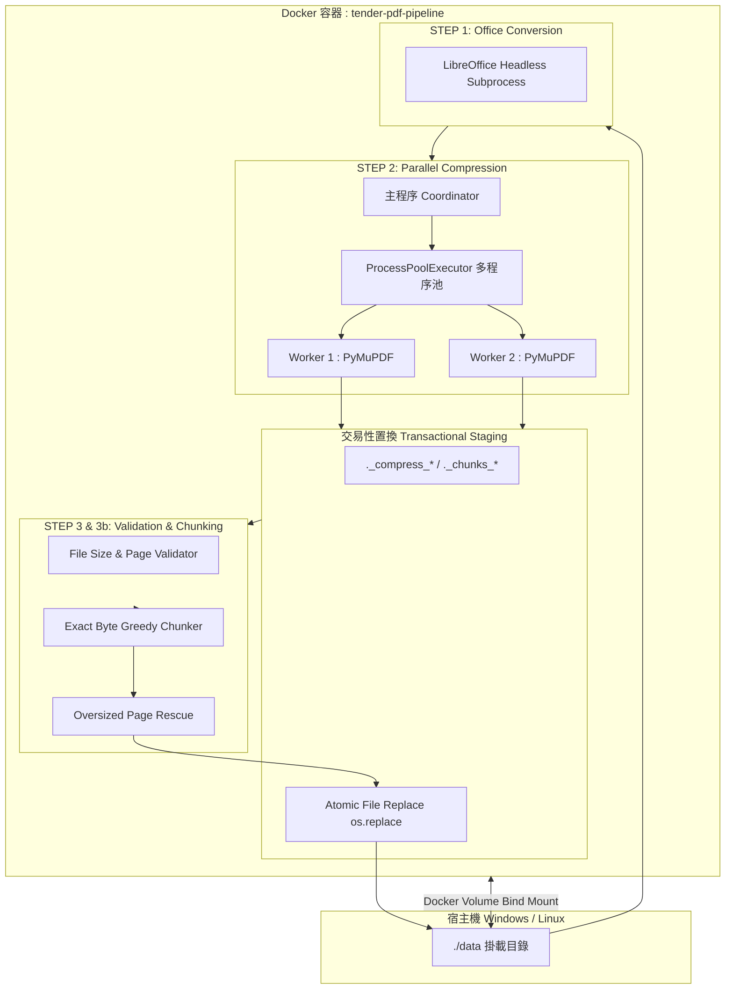

# 系統架構與 RAG 資料流設計 (System Architecture and RAG Data Flow)

**適用對象：** 系統架構師 / 後端工程師 / DevOps 工程師
**文件狀態：** 現行版本
**最後審核：** 2026-10-05

> 備註：以下系統架構與資料流程，於 2026 年 10 月 05 日審閱本文件時仍然有效。

---

## 簡要說明 (Summary)

本文件介紹 `TenderConversion` ETL 管道的內部架構，包括程序隔離、暫存目錄生命週期，以及交易式檔案置換。這些設計用於支援批次處理，並降低作業中斷時產生不完整輸出檔案的風險。

---

## 系統整體拓撲與組件分層 (System Topology)



---

## 核心架構設計特點 (Core Architectural Highlights)

### 1. 程序級平行處理 (Process-Level Parallelism)
- **實作方式：** 管道使用 `concurrent.futures.ProcessPoolExecutor` 建立多程序工作池，而非以多執行緒處理 PDF。
- **程序隔離：** 每個 Worker 程序負責處理 PDF 任務，並在完成後將摘要結果回傳主程序。主程序負責派工與統計；個別檔案發生錯誤時，會依管道的錯誤處理流程回報。

### 2. 暫存目錄生命週期與防污染設計 (Staging Lifecycle)
為避免尚未完成的暫存資料被當成正式輸入，管道會依命名規則管理暫存目錄：
- **前綴標記機制：** 管道中所有暫存目錄均以小數點開頭並帶有專屬標記：
  - 壓縮暫存：`._compress_`
  - 分塊暫存：`._chunks_`
  - 批次執行暫存：`.run_`
  - 備份暫存：`.backup_`
- **掃描隔離（`_discover_pdfs`）：** 在遍歷目錄探索 PDF 時，透過 `_is_pipeline_temp_dir_name` 函式將所有帶有上述標記的目錄直接在遍歷清單中剔除（`directory_names[:] = [...]`），確保管線永遠不會讀取或重複處理未完成的半成品。

### 3. 暫存後置換輸出檔案
為降低寫入中斷造成輸出檔案不完整的風險：
- **先寫入暫存位置：** 壓縮或分塊產生的 PDF 會先寫入暫存路徑，例如 `stage_dir / "publish.pdf"`。
- **置換輸出檔案：** 驗證完成後，管道使用 `os.replace` 將暫存檔移至目標路徑。此操作能降低輸出檔案處於部分寫入狀態的風險；實際行為仍取決於檔案系統及執行環境。

---

## 資料流階段細節 (Data Flow Stages)

```text
[原始目錄 Raw Folder]
   │
   ├── (Step 1) 遞迴搜尋 .doc / .docx
   │      └── 呼叫 libreoffice --headless --convert-to pdf
   │
   ├── (Step 2) 掃描所有 .pdf 檔案
   │      ├── <= 50.0 MB 且 <= 500 頁 ──► [直接複製 (除非 --skip-copy)]
   │      └── > 50.0 MB ──► [分配至 Worker 進行無損重整與圖像降採樣]
   │
   ├── (Step 3) 驗證所有 PDF 大小與頁數
   │      ├── 全部合規 (<50MB & <=500頁) ──► [進入 Step 4]
   │      └── 存在超標檔案 ──► [進入 Step 3b 貪婪分塊]
   │
   ├── (Step 3b) 精確貪婪切分
   │      ├── 計算連續頁面序列化位元組
   │      ├── 切分產生 _chunk-1.pdf, _chunk-2.pdf
   │      └── 若遇超大單頁 ──► [啟動 _rescue_oversized_page 點陣化救援]
   │
   └── (Step 4 & 5) 摘要統計與檔案數量檢查 ──► [輸出資料]
```

---

## 已知限制或待確認項目 (Pending Confirmations & Limitations)

- **待確認：** 生產環境伺服器的 CPU 核心數與記憶體大小。預設 Worker 數量取 2 與可用核心數中的較小值；如需提高平行度，請依主機資源調整 `--workers`。
- **系統限制：** Docker 掛載 Windows 磁碟在超大檔案 I/O 頻繁時可能受限於 9P/VirtioFS 傳輸速率，建議在容器本地 SSD 進行轉檔後再搬移成果。

---

## 相關參考文件 (Related Topics)

- [返回技術分類索引](../Index.md)
- [無損重整、圖像降採樣與貪婪分塊算法](Compression-and-chunking-algorithms.md)
- [GCS 儲存拓撲與同步指引](../02-GCP-and-rag-integration/Gcs-storage-topology-and-sync.md)
- [超大單頁應急點陣化救援機制筆記](../04-Feature-notes/Oversized-page-rescue-mechanism.md)
