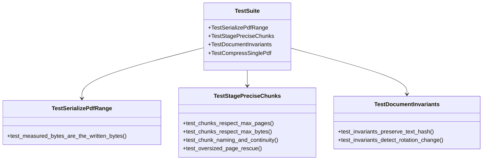

# 自動化測試與回歸檢驗指引 (Test Suite and Validation Guide)

**適用對象：** QA 測試工程師 / 核心開發人員 / CI/CD 維護工程師
**文件狀態：** 現行版本
**最後審核：** 2026-10-05

> 備註：以下單元測試結構與執行指令於 2026 年 10 月 05 日審核此文檔時仍然有效。

---

## 簡要說明 (Summary)

本文件說明 `test_pipeline.py` 測試套件的架構設計、測試案例涵蓋範圍以及執行方式。測試套件採用 **PyMuPDF 記憶體內合成 PDF 技術**，完全無需仰賴外部真實招標合約即可在數秒內模擬高解析度圖像、文字向量、超大檔案與邊界頁面切分，確保管線核心演算法具備高水準的穩定性與無死角回歸保護。

---

## 測試架構與合成資料輔助函式 (Test Architecture)

測試套件內建 4 大專屬合成輔助工具（Helpers），能在記憶體中精準構造不同測試場景：

| 輔助工具函式 | 合成特徵與目的 | 模擬之業務場景 |
|---|---|---|
| `make_pdf(path, num_pages, ...)` | 建立具備文字層之標準多頁 PDF。 | 模擬常規合約規範文字頁。 |
| `make_pdf_with_image(path, ...)` | 嵌入 RGB 彩色圖像。 | 模擬圖文夾雜之招標說明書。 |
| `make_pdf_with_color_detail(path, ...)` | 結合精確文字、向量幾何圖案與 1200x1200 超高解析度圖像。 | 模擬包含細緻標註之工程施工圖紙。 |
| `make_pdf_with_unique_images(path, ...)` | 每頁產生不可壓縮的隨機雜訊點陣圖（`os.urandom`）。 | 模擬極限不可壓縮之超大掃描檔，測試貪婪分塊邊界。 |

---

## 關鍵測試類別與涵蓋情境 (Test Classes & Coverage)



### 1. 序列化長度精準度測試 (`TestSerializePdfRange`)
- **驗證核心：** 斷言 `_serialize_pdf_range` 在記憶體中計算出的位元組大小，與實際寫入磁碟後的檔案大小 **100% 完全相同**。
- **重要性：** 這是貪婪切分演算法能在不進行任何磁碟 I/O 的情況下做出正確邊界決策的基石。

### 2. 精確分塊邊界測試 (`TestStagePreciseChunks`)
- **頁數邊界：** 測試當設定 `max_pages=2` 時，無論檔案大小多小，產出的分塊均不會超過 2 頁。
- **體積邊界：** 測試在遇到隨機不可壓縮的大圖時，分塊是否能精確切斷在 `max_bytes` 之內。
- **命名連續性：** 測試輸出的切分檔案是否符合 `_chunk-1.pdf`, `_chunk-2.pdf` 之命名順序，且涵蓋起訖頁碼完全無縫。

### 3. 文件不變性校驗測試 (`TestDocumentInvariants`)
- 測試當 PDF 經過合法重編碼時，文字 SHA-256 雜湊與幾何 Mediabox 是否保持一致；當刻意竄改文字或旋轉時，驗證函式能否敏銳回傳 `False` 並拒絕採納。

---

## 測試執行指南 (How to Run Tests)

### 方法 A：使用 pytest 執行完整測試並列印詳細過程（推薦）
```powershell
python -m pytest test_pipeline.py -v
```

### 方法 B：直接以 Python 模組執行
```powershell
python test_pipeline.py
```

### 預期輸出範例：
```text
test_pipeline.py::TestSerializePdfRange::test_measured_bytes_are_the_written_bytes PASSED
test_pipeline.py::TestStagePreciseChunks::test_chunks_respect_max_pages PASSED
test_pipeline.py::TestStagePreciseChunks::test_chunks_respect_max_bytes PASSED
test_pipeline.py::TestDocumentInvariants::test_invariants_preserve_text_hash PASSED
============================== 12 passed in 1.84s ==============================
```

---

## 相關參考文件 (Related Topics)

- [返回技術分類索引](../Index.md)
- [無損重整、圖像降採樣與貪婪分塊算法](../01-Architecture/Compression-and-chunking-algorithms.md)
- [本機與 Docker 容器化配置指南](Environment-setup-and-dockerfile.md)
- [超大單頁應急點陣化救援機制筆記](../04-Feature-notes/Oversized-page-rescue-mechanism.md)
