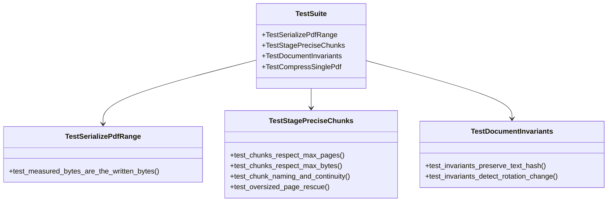

# 自動化測試與回歸檢驗指引 (Test Suite and Validation Guide)

**適用對象：** QA 測試工程師 / 核心開發人員 / CI/CD 維護工程師
**文件狀態：** 現行版本
**最後審核：** 2026-10-05

> 備註：以下測試結構與執行指令，於 2026 年 10 月 05 日審閱本文件時仍然適用。

---

## 簡要說明 (Summary)

本文件介紹 `test_pipeline.py` 測試套件的架構、涵蓋範圍及執行方式。測試會使用 **PyMuPDF 在記憶體中建立合成 PDF**，模擬文字、圖像、較大檔案及分塊邊界等情境，無須使用真實投標文件。

---

## 測試架構與合成資料輔助函式 (Test Architecture)

測試套件使用以下合成資料輔助函式（helpers）建立不同情境：

| 輔助函式 | 合成資料與用途 | 模擬情境 |
|---|---|---|
| `make_pdf(path, num_pages, ...)` | 建立含文字層的多頁 PDF。 | 一般合約或規範文字頁。 |
| `make_pdf_with_image(path, ...)` | 在 PDF 中嵌入 RGB 彩色圖像。 | 圖文混合的招標文件。 |
| `make_pdf_with_color_detail(path, ...)` | 結合文字、向量圖形及 1200x1200 高解析度圖像。 | 含細部標註的工程圖紙。 |
| `make_pdf_with_unique_images(path, ...)` | 每頁產生隨機雜訊圖像（`os.urandom`），以降低壓縮效果。 | 測試大型圖像下的分塊邊界。 |

---

## 關鍵測試類別與涵蓋情境 (Test Classes & Coverage)



### 1. 序列化長度測試 (`TestSerializePdfRange`)
- **驗證核心：** 斷言 `_serialize_pdf_range` 在記憶體中計算出的位元組大小，與實際寫入磁碟後的檔案大小 **100% 完全相同**。
- **用途：** 驗證分塊演算法在依序列化後的實際大小判斷邊界時，所使用的大小資訊正確。

### 2. 精確分塊邊界測試 (`TestStagePreciseChunks`)
- **頁數邊界：** 測試當設定 `max_pages=2` 時，無論檔案大小多小，產出的分塊均不會超過 2 頁。
- **體積邊界：** 使用隨機資料模擬較難壓縮的圖像，檢查分塊是否符合 `max_bytes` 限制。
- **命名與頁面連續性：** 檢查分塊檔案是否依 `_chunk-1.pdf`、`_chunk-2.pdf` 等順序命名，並涵蓋完整且連續的頁面範圍。

### 3. 文件不變性校驗測試 (`TestDocumentInvariants`)
- 測試 PDF 重編碼前後的文字 SHA-256 雜湊與 Mediabox 是否一致，並檢查文字或旋轉角度改變時是否能識別差異。

---

## 測試執行指南 (How to Run Tests)

### 方法 A：使用 pytest 執行測試並顯示詳細結果（建議）
```powershell
python -m pytest test_pipeline.py -v
```

### 方法 B：直接以 Python 模組執行
```powershell
python test_pipeline.py
```

### 預期輸出範例：
```text
test_pipeline.py::TestSerializePdfRange::test_measured_bytes_are_the_written_bytes PASSED
test_pipeline.py::TestStagePreciseChunks::test_chunks_respect_max_pages PASSED
test_pipeline.py::TestStagePreciseChunks::test_chunks_respect_max_bytes PASSED
test_pipeline.py::TestDocumentInvariants::test_invariants_preserve_text_hash PASSED
============================== 12 passed in 1.84s ==============================
```

---

## 相關參考文件 (Related Topics)

- [返回技術分類索引](../Index.md)
- [無損重整、圖像降採樣與貪婪分塊算法](../01-Architecture/Compression-and-chunking-algorithms.md)
- [本機與 Docker 容器化配置指南](Environment-setup-and-dockerfile.md)
- [超大單頁應急點陣化救援機制筆記](../04-Feature-notes/Oversized-page-rescue-mechanism.md)
