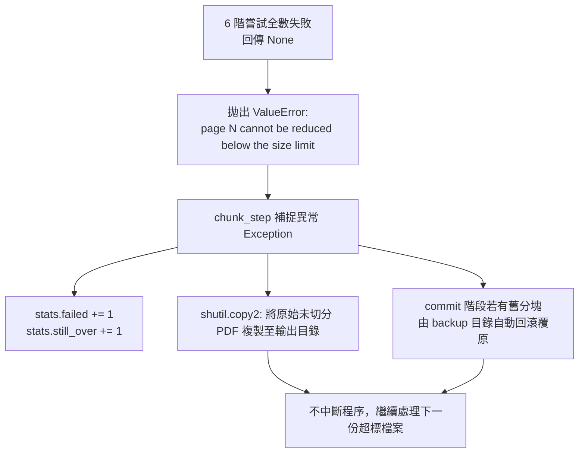

# 超大單頁應急點陣化救援機制筆記 (Oversized Page Rescue Mechanism Notes)

**適用對象：** 演算法工程師 / 後端核心開發者 / 系統架構師  
**文件狀態：** 現行版本  
**最後審核：** 2026-10-05  

> 備註：以下說明依據 `pdf_tender_pipeline.py` 的實作整理，並於 2026 年 10 月 05 日核對。

---

## 簡要說明 (Summary)

本筆記說明 `pdf_tender_pipeline.py` 中 `_rescue_oversized_page` 與 `_stage_precise_chunks` 的處理流程。當單一頁面序列化後仍超過設定的大小上限時，頁面無法再依頁數切分；此時管道會依序嘗試不同的點陣化設定，並將成功處理的頁面輸出為獨立分塊。若所有設定都無法符合大小上限，管道會回報錯誤並保留原始檔案以供檢查。

---

## 程式碼執行路徑與觸發條件 (Code Execution & Trigger Path)

### 1. 觸發時機
- **不在 Step 2 壓縮階段執行：** 一般壓縮函式 `compress_single_pdf` 不會呼叫此單頁點陣化救援流程。
- **只在 Step 3b 分塊階段執行：** `chunk_step` 呼叫 `_stage_precise_chunks` 時，若單頁無法放入目前分塊，才會進入救援判斷。

### 2. 精確觸發邏輯 (`_stage_precise_chunks`)
分塊迴圈會以指數倍增方式探測可容納的頁面範圍：

```python
# 截自 pdf_tender_pipeline.py (約第 820-870 行)
start_page = 0
while start_page < total_pages:
    end_page = start_page
    accepted_bytes = None
    maximum_end_page = min(start_page + max_pages, total_pages)
    failed_end_page = None
    probe_end_page = start_page + 1

    # 首次探測單頁：start_page 至 start_page + 1
    while probe_end_page <= maximum_end_page:
        candidate_bytes = _serialize_pdf_range(doc, start_page, probe_end_page)
        if len(candidate_bytes) >= max_bytes:
            failed_end_page = probe_end_page
            break
        accepted_bytes = candidate_bytes
        ...
```

- **觸發條件：** 若第一個單頁候選範圍 `start_page` 至 `start_page + 1` 的序列化大小大於或等於 `max_bytes`：
  1. 探測迴圈會立即結束，此時 `accepted_bytes` 仍為 `None`。
  2. 由於沒有可接受的候選分塊，二分搜尋會略過。
  3. 流程接著進入單頁救援判斷：
     ```python
     if accepted_bytes is None:
         rescue_result = _rescue_oversized_page(doc, start_page, max_bytes)
         if rescue_result is None:
             page_number = start_page + 1
             raise ValueError(f"page {page_number} cannot be reduced below the size limit")
         accepted_bytes, dpi, jpeg_quality = rescue_result
         end_page = start_page + 1
         rescued = True
         rescue_settings = (dpi, jpeg_quality)
     ```

---

## 救援演算法核心實作剖析 (`_rescue_oversized_page`)

以下程式碼摘錄自 `_rescue_oversized_page`（原始碼約第 754 至 802 行）：

```python
def _rescue_oversized_page(doc, page_index: int, max_bytes: float):
    """Rasterizes one oversized page at progressively smaller settings."""
    page = doc[page_index]
    attempts = (
        (180, 75),
        (150, 70),
        (120, 60),
        (96, 50),
        (72, 40),
        (50, 30),
    )

    for dpi, jpeg_quality in attempts:
        # 1. 以灰階彩現、強制關閉 Alpha 透明通道
        pixmap = page.get_pixmap(dpi=dpi, colorspace=pymupdf.csGRAY, alpha=False)
        # 2. 轉為 PIL 8 位元灰階影像 (Mode 'L')
        image = Image.frombytes("L", (pixmap.width, pixmap.height), pixmap.samples)
        image_buffer = io.BytesIO()
        # 3. 實施 JPEG Huffman 最佳化壓縮
        image.save(image_buffer, format="JPEG", quality=jpeg_quality, optimize=True)

        # 4. 建立純淨單頁 PDF，幾何長寬 100% 映射原頁面
        rescued_doc = pymupdf.open()
        try:
            rescued_page = rescued_doc.new_page(
                width=page.rect.width,
                height=page.rect.height,
            )
            rescued_page.insert_image(
                rescued_page.rect,
                stream=image_buffer.getvalue(),
            )
            # 5. 序列化測試位元組
            rescued_bytes = rescued_doc.tobytes(garbage=3, deflate=True)
        finally:
            rescued_doc.close()

        # 6. 一旦嚴格小於 max_bytes 立即成功返回
        if len(rescued_bytes) < max_bytes:
            return rescued_bytes, dpi, jpeg_quality

    return None
```

### 關鍵工程細節：
1. **依序嘗試六組設定：**
   - 順序為 `(180, 75)`、`(150, 70)`、`(120, 60)`、`(96, 50)`、`(72, 40)`、`(50, 30)`，數值分別代表 DPI 與 JPEG 品質。
   - 每次都先嘗試較高的解析度與品質；候選檔小於 `max_bytes` 時即停止嘗試。
2. **轉為灰階影像 (`pymupdf.csGRAY`)：**
   - 彩現時使用灰階色彩空間，並以 `alpha=False` 關閉 Alpha 通道。
   - PIL 影像使用 `L` 模式，再以 JPEG 格式儲存。
3. **將救援頁面獨立輸出：**
   - 救援成功後，`end_page` 設為 `start_page + 1`，因此該頁會成為單頁分塊，不會與前後頁合併。
   - 處理完成後，管道會從下一頁繼續進行一般分塊。

---

## 救援成功時的日誌與統計 (Success Reporting)

救援成功時，管道會在終端輸出分塊頁碼、檔案大小及採用的 DPI 與 JPEG 品質：

```text
# 終端機即時輸出 (Console Output)
📄 Chunking: Drawings_A0.pdf (120.00 MB, 10 pages)
   • Produced: Drawings_A0_chunk-1.pdf (pp. 1-2, 45.20 MB)
   • Produced: Drawings_A0_chunk-2.pdf (p. 3, 38.15 MB, rasterized at 150 DPI / quality 70)
   • Produced: Drawings_A0_chunk-3.pdf (pp. 4-10, 41.50 MB)
```

- **統計資訊：** 摘要報告中的 `Oversized pages rescued` 計數器會增加 1。

---

## 全階梯皆失敗時的退避與事務保護 (Failure Fallback & Rollback)

若單頁採用最低設定 `(50 DPI, Q=30)` 後仍大於或等於 `max_bytes`：



### 錯誤處理流程
1. **回報該檔案處理失敗：** `chunk_step` 會捕捉例外，輸出 `❌ Failed to chunk <file>: <error>`，並將該檔案計入 `still_over`。
2. **保留原始檔案：**
   ```python
   # 若輸出目錄中未有該檔案，強制自來源複製原始檔案，確保檔案不遺失
   if not output_pdf.exists() and pdf_path != output_pdf:
       shutil.copy2(pdf_path, output_pdf)
   ```
3. **顯示摘要警告：**
   執行結束時印出：
   `⚠️ 1 file(s) could not be chunked below 50.0 MB. The original files were preserved for manual review.`
4. **回復既有分塊（`_commit_precise_chunks`）：**
   若提交暫存分塊時發生錯誤，管道會從備份目錄復原既有分塊，避免留下不完整的替換結果。

---

## 維運處置標準作業程序 (Operator Action SOP)

若日誌顯示單頁救援失敗，維運人員可依下列步驟處理：

1. **確認頁碼：** 從錯誤訊息找出無法處理的頁面，例如 `page 4 cannot be reduced below the size limit`。
2. **檢查來源頁面：** 使用適當的 PDF、CAD 或設計工具檢視原始內容，確認該頁是否包含複雜圖層或大型影像。
3. **評估處理方式：**
   - 方案 A：從 CAD 重新輸出時降低點陣底圖解析度，或移除不需要的密集圖層。
   - 方案 B：將圖紙拆分為多張局部圖後，再重新交由管線處理。

---

## 相關參考文件 (Related Topics)

- [返回技術分類索引](../Index.md)
- [無損重整、圖像降採樣與貪婪分塊算法](../01-Architecture/Compression-and-chunking-algorithms.md)
- [常見問題與故障排除手冊](../../02-ETL-and-operations/04-Support/Troubleshooting-and-faq.md)
- [投標文件品質檢核與驗證清單](../../02-ETL-and-operations/02-RAG-spec-and-limits/Document-quality-and-verification-checklist.md)
