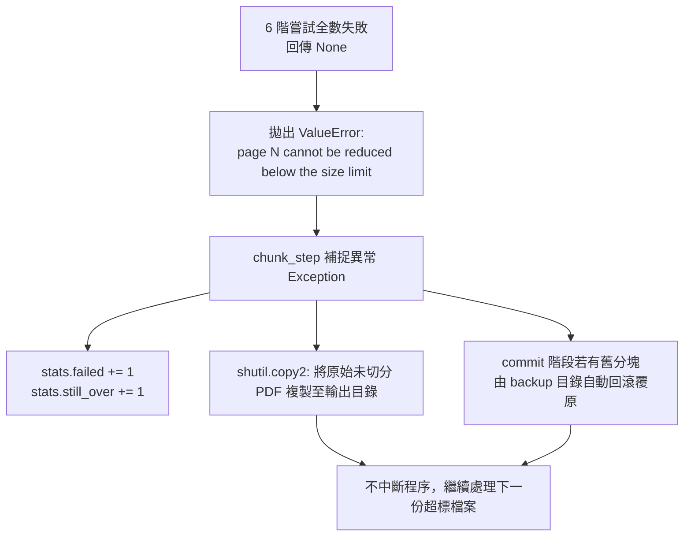

# 超大單頁應急點陣化救援機制筆記 (Oversized Page Rescue Mechanism Notes)

**適用對象：** 演算法工程師 / 後端核心開發者 / 系統架構師  
**文件狀態：** 現行版本  
**最後審核：** 2026-10-05  

> 備註：以下分析直接對比 `pdf_tender_pipeline.py` 原始碼實作，於 2026 年 10 月 05 日查核時 100% 一致。

---

## 簡要說明 (Summary)

本筆記深度解析 `pdf_tender_pipeline.py` 原始碼中之 `_rescue_oversized_page` 與 `_stage_precise_chunks` 救援架構。在工程圖紙（如 A0 全區管線配置圖、高精細地圖）的處理過程中，偶爾會遇到「單一頁面」序列化後體積即超越 **Google Cloud 50.0 MB** 限制的極端狀況。本文件逐行比對真實程式碼，說明系統如何精確觸發、階梯式降階彩現、封裝單頁分塊、並在極限失敗時提供無損復原與備份退避。

---

## 程式碼執行路徑與觸發條件 (Code Execution & Trigger Path)

### 1. 觸發生命週期位置
- **非 Step 2 壓縮階段：** 常規壓縮階段（`compress_single_pdf`）**絕對不會**觸發全頁點陣化救援，以確保原生文字向量層 100% 完整。
- **純屬 Step 3b 分塊階段：** 救援機制僅在 `chunk_step` -> `_stage_precise_chunks` 迴圈中被調用。

### 2. 精確觸發邏輯 (`_stage_precise_chunks`)
在分塊迴圈中，系統以指數倍增探測可容納的頁面範圍：

```python
# 截自 pdf_tender_pipeline.py (約第 820-870 行)
start_page = 0
while start_page < total_pages:
    end_page = start_page
    accepted_bytes = None
    maximum_end_page = min(start_page + max_pages, total_pages)
    failed_end_page = None
    probe_end_page = start_page + 1

    # 首次探測單頁：start_page 至 start_page + 1
    while probe_end_page <= maximum_end_page:
        candidate_bytes = _serialize_pdf_range(doc, start_page, probe_end_page)
        if len(candidate_bytes) >= max_bytes:
            failed_end_page = probe_end_page
            break
        accepted_bytes = candidate_bytes
        ...
```

- **觸發判斷點：** 當連第一頁 `probe_end_page = start_page + 1` 序列化後的 `len(candidate_bytes)` 都大於或等於 `max_bytes`（50 MB）時：
  1. 迴圈立即 `break`，此時 `accepted_bytes` 依然為 `None`。
  2. 隨後的二分搜尋區間因 `accepted_bytes is None` 直接跳過。
  3. 進入救援判定分支：
     ```python
     if accepted_bytes is None:
         rescue_result = _rescue_oversized_page(doc, start_page, max_bytes)
         if rescue_result is None:
             page_number = start_page + 1
             raise ValueError(f"page {page_number} cannot be reduced below the size limit")
         accepted_bytes, dpi, jpeg_quality = rescue_result
         end_page = start_page + 1
         rescued = True
         rescue_settings = (dpi, jpeg_quality)
     ```

---

## 救援演算法核心實作剖析 (`_rescue_oversized_page`)

完整實作如下（`pdf_tender_pipeline.py` 第 754-802 行）：

```python
def _rescue_oversized_page(doc, page_index: int, max_bytes: float):
    """Rasterizes one oversized page at progressively smaller settings."""
    page = doc[page_index]
    attempts = (
        (180, 75),
        (150, 70),
        (120, 60),
        (96, 50),
        (72, 40),
        (50, 30),
    )

    for dpi, jpeg_quality in attempts:
        # 1. 以灰階彩現、強制關閉 Alpha 透明通道
        pixmap = page.get_pixmap(dpi=dpi, colorspace=pymupdf.csGRAY, alpha=False)
        # 2. 轉為 PIL 8 位元灰階影像 (Mode 'L')
        image = Image.frombytes("L", (pixmap.width, pixmap.height), pixmap.samples)
        image_buffer = io.BytesIO()
        # 3. 實施 JPEG Huffman 最佳化壓縮
        image.save(image_buffer, format="JPEG", quality=jpeg_quality, optimize=True)

        # 4. 建立純淨單頁 PDF，幾何長寬 100% 映射原頁面
        rescued_doc = pymupdf.open()
        try:
            rescued_page = rescued_doc.new_page(
                width=page.rect.width,
                height=page.rect.height,
            )
            rescued_page.insert_image(
                rescued_page.rect,
                stream=image_buffer.getvalue(),
            )
            # 5. 序列化測試位元組
            rescued_bytes = rescued_doc.tobytes(garbage=3, deflate=True)
        finally:
            rescued_doc.close()

        # 6. 一旦嚴格小於 max_bytes 立即成功返回
        if len(rescued_bytes) < max_bytes:
            return rescued_bytes, dpi, jpeg_quality

    return None
```

### 關鍵工程細節：
1. **6 階遞降梯隊 (Progressive 6-Step Ladder)：**
   - 依序嘗試：`(180, 75)` -> `(150, 70)` -> `(120, 60)` -> `(96, 50)` -> `(72, 40)` -> `(50, 30)`。
   - 優先以最高可能清晰度（180 DPI / Q=75）嘗試，一旦滿足 `< max_bytes` 立即提前終止，絕不過度壓縮。
2. **色彩空間降維 (`pymupdf.csGRAY`)：**
   - 將 RGB 3 通道降為單通道灰階，瞬間消除 66% 未壓縮記憶體開銷。
   - 關閉 Alpha 透明通道（`alpha=False`），杜絕 RGBA 帶來的冗餘圖層資料。
3. **單頁獨立分塊（Isolated Single-Page Chunk）：**
   - 成功救援的頁面，`end_page` 必定強制設定為 `start_page + 1`。
   - 該頁面會被**單獨封裝**為獨立的 `_chunk-N.pdf`，絕不會與前後頁面合併。
   - 隨後 `start_page` 推進至下一頁，繼續回歸常規貪婪演算法。

---

## 救援成功時之日誌與統計輸出 (Success Reporting)

當某一頁面被救援成功時，系統會紀錄元數據並輸出終端提示：

```text
# 終端機即時輸出 (Console Output)
📄 Chunking: Drawings_A0.pdf (120.00 MB, 10 pages)
   • Produced: Drawings_A0_chunk-1.pdf (pp. 1-2, 45.20 MB)
   • Produced: Drawings_A0_chunk-2.pdf (p. 3, 38.15 MB, rasterized at 150 DPI / quality 70)
   • Produced: Drawings_A0_chunk-3.pdf (pp. 4-10, 41.50 MB)
```

- **統計指標：** 摘要報告中 `Oversized pages rescued` 計數器增加 1。

---

## 全階梯皆失敗時的退避與事務保護 (Failure Fallback & Rollback)

若某單一頁面即使降至最低階 `(50 DPI, Q=30)` 依然 `>= max_bytes`（例如畫布尺寸極為巨大）：



### 原始碼行為保證：
1. **絕不中斷整個批次：** `chunk_step` 會攔截例外，印出 `❌ Failed to chunk <file>: <error>`，並將該檔案計入 `still_over`。
2. **來源檔案安全備份（Zero Data Loss）：**
   ```python
   # 若輸出目錄中未有該檔案，強制自來源複製原始檔案，確保檔案不遺失
   if not output_pdf.exists() and pdf_path != output_pdf:
       shutil.copy2(pdf_path, output_pdf)
   ```
3. **終端警告提示：**
   執行結束時印出：
   `⚠️ 1 file(s) could not be chunked below 50.0 MB. The original files were preserved for manual review.`
4. **交易性回滾（`_commit_precise_chunks`）：**
   若暫存切分在替換途中拋出異常，備份目錄中的既有分塊會逆序原樣復原，絕不留下半殘的檔案。

---

## 維運處置標準作業程序 (Operator Action SOP)

當日誌出現單頁救援失敗時，維運人員應採取以下處置：

1. **查閱日誌定位頁碼：** 從日誌中找出具體失敗頁數（如 `page 4 cannot be reduced below the size limit`）。
2. **人工審閱該頁內容：** 在原始 CAD 或設計軟體中檢視該頁，通常為包含海量圖層的未平整化向量地圖。
3. **改善處置方案：**
   - 方案 A（推薦）：在 CAD 轉存時降低點陣底圖解析度，或隱藏無關之密集網格圖層。
   - 方案 B：將該圖紙切分為多張局部圖（Tiles）後重新輸入管線。

---

## 相關參考文件 (Related Topics)

- [返回技術分類索引](../Index.md)
- [無損重整、圖像降採樣與貪婪分塊算法](../01-Architecture/Compression-and-chunking-algorithms.md)
- [常見問題與故障排除手冊](../../02-ETL-and-operations/04-Support/Troubleshooting-and-faq.md)
- [投標文件品質檢核與驗證清單](../../02-ETL-and-operations/02-RAG-spec-and-limits/Document-quality-and-verification-checklist.md)
